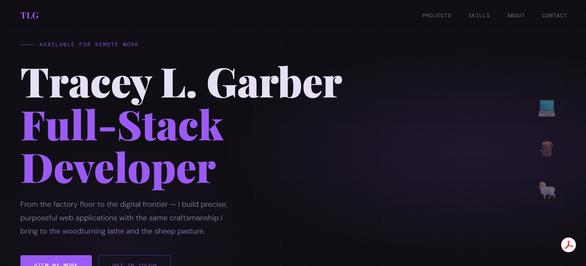

# Tracey L. Garber | Portfolio Website

A personal portfolio website showcasing my journey from precision manufacturing to full-stack web development.

🔗 **Live Site:** [elmofud.github.io](https://elmofud.github.io)



<!-- Add a screenshot of your site and save it as screenshot.png in the repo -->

---

## About This Project

This portfolio serves as my professional hub — a place where potential employers and collaborators can learn about my background, explore my projects, and connect with me. Built from scratch using vanilla HTML, CSS, and JavaScript, it reflects the same craftsmanship I bring to woodturning and the precision I developed over 31 years in manufacturing.

### Objectives

- Present my work and skills in a clean, professional format
- Tell the story of my career transition into tech
- Provide easy access to my projects, contact info, and social links
- Demonstrate front-end development fundamentals without relying on frameworks

---

## Features

- **Responsive Design** — Fully optimized for desktop, tablet, and mobile screens
- **Smooth Scroll Navigation** — Seamless transitions between sections
- **Active Nav Highlighting** — Navigation links update based on scroll position
- **Dark Theme with Custom Styling** — Professional aesthetic using CSS variables
- **Subtle Animations** — Fade-in effects and floating icons add polish without distraction
- **Accessible Structure** — Semantic HTML for better screen reader support

---

## Technologies Used

| Category      | Tools                                             |
| ------------- | ------------------------------------------------- |
| Structure     | HTML5                                             |
| Styling       | CSS3, CSS Variables, Flexbox, Grid                |
| Interactivity | Vanilla JavaScript                                |
| Fonts         | Google Fonts (Playfair Display, DM Mono, DM Sans) |
| Hosting       | GitHub Pages                                      |

---

## Sections

1. **Hero** — Introduction with tagline and call-to-action buttons
2. **Projects** — Featured work with links to live demos and GitHub repos
3. **Skills** — Technical stack displayed in an interactive grid
4. **About** — Background story, career transition, and personal interests
5. **Contact** — Email, GitHub, and LinkedIn links

---

## Run Locally

To view or edit this project on your machine:

```bash
# Clone the repository
git clone https://github.com/elmofud/elmofud.github.io.git

# Navigate into the folder
cd elmofud.github.io

# Open in your browser
open index.html
# Or use Live Server in VS Code for hot reloading
```

No dependencies or build steps required — it's pure HTML, CSS, and JavaScript.

---

## Project Structure

```
elmofud.github.io/
├── index.html      # Main HTML structure
├── styles.css      # All styling and responsive rules
├── script.js       # Scroll-based navigation highlighting
├── README.md       # Project documentation (this file)
└── screenshot.png  # Portfolio screenshot (add this)
```

---

## Future Improvements

- [ ] Add a favicon for browser tab branding
- [ ] Include `<meta description>` for better SEO
- [ ] Add `prefers-reduced-motion` support for accessibility
- [ ] Create a dark/light theme toggle
- [ ] Add a fourth featured project

---

## Connect With Me

- 📧 **Email:** [traceylg43@gmail.com](mailto:traceylg43@gmail.com)
- 💼 **LinkedIn:** [linkedin.com/in/tlgarber](https://linkedin.com/in/tlgarber)
- 🐙 **GitHub:** [github.com/elmofud](https://github.com/elmofud)

---

## License

This project is open source and available for personal inspiration. If you use any part of this design, a shoutout is appreciated!

---

_Built with care in Peru, Indiana — 2025_
